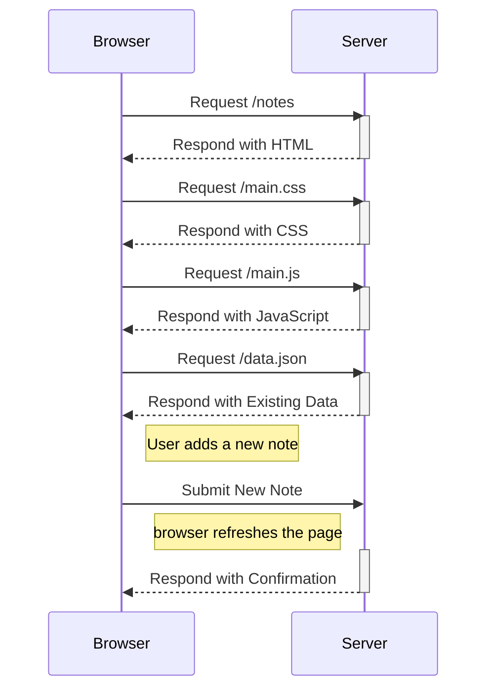

# New Note

```mermaid

sequenceDiagram
    participant Browser
    participant Server

    Browser->>Server: Request /notes
    activate Server
    Server-->>Browser: Respond with HTML
    deactivate Server

    Browser->>Server: Request /main.css
    activate Server
    Server-->>Browser: Respond with CSS
    deactivate Server

    Browser->>Server: Request /main.js
    activate Server
    Server-->>Browser: Respond with JavaScript
    deactivate Server

    Browser->>Server: Request /data.json
    activate Server
    Server-->>Browser: Respond with Existing Data
    deactivate Server

    Note right of Browser: User adds a new note
    Browser->>Server: Submit New Note
    Note left of Server: browser refreshes the page
    activate Server
    Server-->>Browser: Respond with Confirmation
    deactivate Server

```
