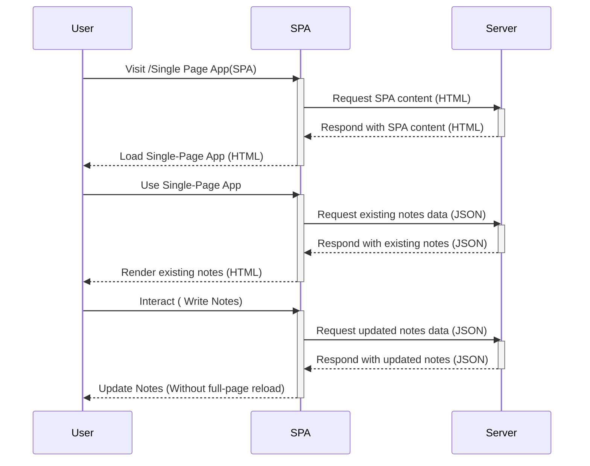

#Single page app

```mermaid
sequenceDiagram
    participant User
    participant SPA
    participant Server

    User->>SPA: Visit /Single Page App(SPA)
    activate SPA
    SPA->>Server: Request SPA content (HTML)
    activate Server
    Server-->>SPA: Respond with SPA content (HTML)
    deactivate Server
    SPA-->>User: Load Single-Page App (HTML)
    deactivate SPA

    User->>SPA: Use Single-Page App
    activate SPA
    SPA->>Server: Request existing notes data (JSON)
    activate Server
    Server-->>SPA: Respond with existing notes (JSON)
    deactivate Server
    SPA-->>User: Render existing notes (HTML)
    deactivate SPA

    User->>SPA: Interact ( Write Notes)
    activate SPA
    SPA->>Server: Request updated notes data (JSON)
    activate Server
    Server-->>SPA: Respond with updated notes (JSON)
    deactivate Server
    SPA-->>User: Update Notes (Without full-page reload)
    deactivate SPA

```
