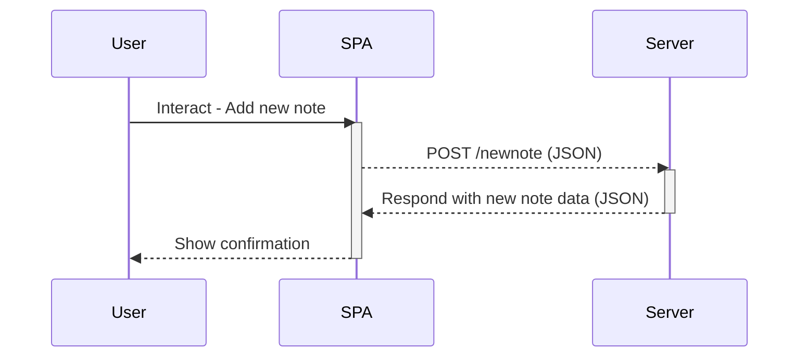

# Creating a New note in Single page app

```mermaid
sequenceDiagram
    participant User
    participant SPA
    participant Server

    User->>SPA: Interact - Add new note
    activate SPA

    SPA-->>Server: POST /newnote (JSON)
    activate Server
    Server-->>SPA: Respond with new note data (JSON)
    deactivate Server

    SPA-->>User: Show confirmation
    deactivate SPA


```
